# PaperLens AI — DB 스키마 설계

## 개요

MD 파일 기준 총 **23개 테이블**로 정규화. 섹션별 그룹은 다음과 같습니다.

| 그룹 | 테이블 |
|---|---|
| 사용자 | `users` |
| 논문 | `papers`, `paper_summaries`, `paper_citations`, `critical_reviews`, `citation_outputs`, `trend_recommendations` |
| Q&A | `qa_sessions`, `qa_messages`, `qa_citations`, `highlights` |
| 아카이브 | `user_papers`, `folders`, `folder_papers` |
| 비교 분석 | `comparison_projects`, `comparison_papers`, `comparison_matrices`, `matrix_cells` |
| 팀 & 협업 | `teams`, `team_members`, `team_chats`, `paper_votes` |
| 소셜 피드 | `social_feed_posts`, `social_feed_reactions` |

### 배지 범례

| 배지 | 의미 |
|---|---|
| `PK` | Primary Key |
| `FK` | Foreign Key |
| `IDX` | Index |
| `UQ` | Unique 제약 |

---

## ERD

```mermaid
erDiagram
  USERS {
    uuid id PK
    string email
    string name
    string password_hash
    enum plan "free | pro | team"
    timestamp plan_expires_at
    timestamp created_at
  }

  PAPERS {
    uuid id PK
    uuid uploaded_by_user_id FK
    string title
    text abstract
    string doi
    string arxiv_id
    string source_url
    string file_path
    int page_count
    timestamp published_at
    timestamp created_at
  }

  PAPER_SUMMARIES {
    uuid id PK
    uuid paper_id FK
    enum target_level "general | undergrad | researcher"
    string language
    text purpose
    text methodology
    text conclusion
    text limitations
    timestamp created_at
  }

  PAPER_CITATIONS {
    uuid id PK
    uuid paper_id FK
    uuid cited_paper_id FK
    string relationship_type
  }

  CRITICAL_REVIEWS {
    uuid id PK
    uuid paper_id FK
    text sample_size_analysis
    text statistical_validity
    text reproducibility
    text contradiction_notes
    timestamp created_at
  }

  CITATION_OUTPUTS {
    uuid id PK
    uuid paper_id FK
    uuid user_id FK
    enum format "apa | mla | bibtex | chicago"
    text citation_text
    timestamp created_at
  }

  TREND_RECOMMENDATIONS {
    uuid id PK
    uuid paper_id FK
    uuid recommended_paper_id FK
    float relevance_score
    string source_db
    timestamp fetched_at
  }

  QA_SESSIONS {
    uuid id PK
    uuid paper_id FK
    uuid user_id FK
    timestamp created_at
  }

  QA_MESSAGES {
    uuid id PK
    uuid session_id FK
    enum role "user | assistant"
    text content
    timestamp created_at
  }

  QA_CITATIONS {
    uuid id PK
    uuid message_id FK
    int page_number
    int line_start
    int line_end
    text excerpt
  }

  HIGHLIGHTS {
    uuid id PK
    uuid paper_id FK
    uuid user_id FK
    text selected_text
    int page_number
    text explanation
    timestamp created_at
  }

  USER_PAPERS {
    uuid id PK
    uuid user_id FK
    uuid paper_id FK
    boolean is_bookmarked
    timestamp added_at
    timestamp last_read_at
  }

  FOLDERS {
    uuid id PK
    uuid owner_user_id FK
    uuid team_id FK
    string name
    boolean is_shared
    timestamp created_at
  }

  FOLDER_PAPERS {
    uuid id PK
    uuid folder_id FK
    uuid paper_id FK
    uuid added_by_user_id FK
    timestamp added_at
  }

  COMPARISON_PROJECTS {
    uuid id PK
    uuid created_by_user_id FK
    string name
    timestamp created_at
  }

  COMPARISON_PAPERS {
    uuid id PK
    uuid project_id FK
    uuid paper_id FK
    int display_order
  }

  COMPARISON_MATRICES {
    uuid id PK
    uuid project_id FK
    string column_key
    string column_label
    int display_order
  }

  MATRIX_CELLS {
    uuid id PK
    uuid matrix_id FK
    uuid paper_id FK
    text extracted_value
    timestamp created_at
  }

  TEAMS {
    uuid id PK
    uuid owner_user_id FK
    string name
    timestamp created_at
  }

  TEAM_MEMBERS {
    uuid id PK
    uuid team_id FK
    uuid user_id FK
    enum role "owner | member"
    timestamp joined_at
  }

  TEAM_CHATS {
    uuid id PK
    uuid team_id FK
    uuid sender_user_id FK
    text message
    timestamp sent_at
  }

  PAPER_VOTES {
    uuid id PK
    uuid folder_id FK
    uuid paper_id FK
    uuid user_id FK
    timestamp voted_at
  }

  SOCIAL_FEED_POSTS {
    uuid id PK
    uuid author_user_id FK
    uuid paper_id FK
    uuid session_id FK
    text note
    boolean is_public
    timestamp created_at
  }

  SOCIAL_FEED_REACTIONS {
    uuid id PK
    uuid post_id FK
    uuid user_id FK
    enum reaction_type "like | comment"
    text comment_text
    timestamp created_at
  }

  USERS ||--o{ USER_PAPERS : "saves"
  USERS ||--o{ FOLDERS : "owns"
  USERS ||--o{ QA_SESSIONS : "conducts"
  USERS ||--o{ HIGHLIGHTS : "creates"
  USERS ||--o{ CITATION_OUTPUTS : "generates"
  USERS ||--o{ TEAM_MEMBERS : "belongs to"
  USERS ||--o{ TEAM_CHATS : "sends"
  USERS ||--o{ SOCIAL_FEED_POSTS : "posts"
  USERS ||--o{ SOCIAL_FEED_REACTIONS : "reacts"
  USERS ||--o{ COMPARISON_PROJECTS : "creates"
  USERS ||--o{ FOLDER_PAPERS : "adds"
  USERS ||--o{ PAPER_VOTES : "votes"
  USERS ||--o{ PAPERS : "uploads"

  PAPERS ||--o{ PAPER_SUMMARIES : "has"
  PAPERS ||--o{ PAPER_CITATIONS : "cites"
  PAPERS ||--o{ PAPER_CITATIONS : "cited by"
  PAPERS ||--o{ QA_SESSIONS : "subject of"
  PAPERS ||--o{ HIGHLIGHTS : "has"
  PAPERS ||--o{ CITATION_OUTPUTS : "generates"
  PAPERS ||--o{ CRITICAL_REVIEWS : "has"
  PAPERS ||--o{ USER_PAPERS : "saved in"
  PAPERS ||--o{ FOLDER_PAPERS : "placed in"
  PAPERS ||--o{ COMPARISON_PAPERS : "included in"
  PAPERS ||--o{ TREND_RECOMMENDATIONS : "source of"
  PAPERS ||--o{ TREND_RECOMMENDATIONS : "recommended as"
  PAPERS ||--o{ SOCIAL_FEED_POSTS : "referenced in"

  QA_SESSIONS ||--o{ QA_MESSAGES : "contains"
  QA_MESSAGES ||--o{ QA_CITATIONS : "has source"

  FOLDERS ||--o{ FOLDER_PAPERS : "contains"
  FOLDERS }o--|| TEAMS : "owned by"

  TEAMS ||--o{ TEAM_MEMBERS : "has"
  TEAMS ||--o{ TEAM_CHATS : "has"

  COMPARISON_PROJECTS ||--o{ COMPARISON_PAPERS : "includes"
  COMPARISON_PROJECTS ||--o{ COMPARISON_MATRICES : "has columns"
  COMPARISON_MATRICES ||--o{ MATRIX_CELLS : "has values"
  COMPARISON_PAPERS ||--o{ MATRIX_CELLS : "fills"

  SOCIAL_FEED_POSTS ||--o{ SOCIAL_FEED_REACTIONS : "receives"

  FOLDER_PAPERS ||--o{ PAPER_VOTES : "voted on"
```

---

## 테이블 상세

### 사용자

#### `users` — 핵심

| 필드 | 타입 | 제약 | 역할 |
|---|---|---|---|
| id | uuid | PK | 사용자 고유 ID |
| email | varchar | IDX, UQ | 로그인 이메일 |
| name | varchar | | 표시 이름 |
| password_hash | varchar | | 암호화된 비밀번호 |
| plan | enum | | free / pro / team |
| plan_expires_at | timestamp | | 플랜 만료일 |
| created_at | timestamp | | 가입일 |

---

### 논문

#### `papers` — 핵심

| 필드 | 타입 | 제약 | 역할 |
|---|---|---|---|
| id | uuid | PK | 논문 고유 ID |
| uploaded_by_user_id | uuid | FK | 업로드한 사용자 |
| title | varchar | IDX | 논문 제목 |
| abstract | text | | 논문 초록 |
| doi | varchar | IDX, UQ | DOI 식별자 |
| arxiv_id | varchar | UQ | arXiv 논문 ID |
| source_url | varchar | | 원본 URL |
| file_path | varchar | | 저장된 PDF 경로 |
| page_count | int | | 총 페이지 수 |
| published_at | timestamp | | 논문 발행일 |
| created_at | timestamp | | 업로드일 |

#### `paper_summaries` — 기능

> `target_level`로 일반인 / 학부생 / 연구원 수준별 요약을 별도 행으로 저장

| 필드 | 타입 | 제약 | 역할 |
|---|---|---|---|
| id | uuid | PK | 요약 고유 ID |
| paper_id | uuid | FK | 대상 논문 |
| target_level | enum | | general / undergrad / researcher |
| language | varchar | | 요약 언어 (ko, en…) |
| purpose | text | | 연구 목적 요약 |
| methodology | text | | 연구 방법론 요약 |
| conclusion | text | | 결론 요약 |
| limitations | text | | 한계점 요약 |
| created_at | timestamp | | 생성일 |

#### `paper_citations` — 관계

> Self-referencing 구조로 인용망 양방향 구현 (인용하는 논문 → 인용된 논문)

| 필드 | 타입 | 제약 | 역할 |
|---|---|---|---|
| id | uuid | PK | 인용 관계 고유 ID |
| paper_id | uuid | FK | 인용하는 논문 (출처) |
| cited_paper_id | uuid | FK | 인용된 논문 (대상) |
| relationship_type | varchar | | 인용 성격 (지지·반박 등) |

#### `critical_reviews` — 기능

| 필드 | 타입 | 제약 | 역할 |
|---|---|---|---|
| id | uuid | PK | 리뷰 고유 ID |
| paper_id | uuid | FK | 대상 논문 |
| sample_size_analysis | text | | 샘플 크기 적절성 분석 |
| statistical_validity | text | | 통계적 유의성 검토 |
| reproducibility | text | | 재현성 이슈 분석 |
| contradiction_notes | text | | 선행 연구 모순점 |
| created_at | timestamp | | 생성일 |

#### `citation_outputs` — 기능

| 필드 | 타입 | 제약 | 역할 |
|---|---|---|---|
| id | uuid | PK | 인용 출력 고유 ID |
| paper_id | uuid | FK | 대상 논문 |
| user_id | uuid | FK | 요청한 사용자 |
| format | enum | | apa / mla / bibtex / chicago |
| citation_text | text | | 생성된 인용 문자열 |
| created_at | timestamp | | 생성일 |

#### `trend_recommendations` — 기능

| 필드 | 타입 | 제약 | 역할 |
|---|---|---|---|
| id | uuid | PK | 추천 고유 ID |
| paper_id | uuid | FK | 기준 논문 |
| recommended_paper_id | uuid | FK | 추천된 최신 논문 |
| relevance_score | float | | 연관도 점수 (0~1) |
| source_db | varchar | | 출처 학술 DB명 |
| fetched_at | timestamp | | 추천 조회 시각 |

---

### Q&A

#### `qa_sessions` — 기능

| 필드 | 타입 | 제약 | 역할 |
|---|---|---|---|
| id | uuid | PK | 세션 고유 ID |
| paper_id | uuid | FK | 대화 대상 논문 |
| user_id | uuid | FK | 대화한 사용자 |
| created_at | timestamp | | 세션 시작일 |

#### `qa_messages` — 기능

| 필드 | 타입 | 제약 | 역할 |
|---|---|---|---|
| id | uuid | PK | 메시지 고유 ID |
| session_id | uuid | FK | 소속 대화 세션 |
| role | enum | | user / assistant |
| content | text | | 메시지 본문 |
| created_at | timestamp | | 전송 시각 |

#### `qa_citations` — 관계

> 스플릿 뷰 하이라이트 지원 — AI 답변 근거 페이지·라인 추적

| 필드 | 타입 | 제약 | 역할 |
|---|---|---|---|
| id | uuid | PK | 출처 고유 ID |
| message_id | uuid | FK | 근거가 된 AI 응답 메시지 |
| page_number | int | | 참조 페이지 번호 |
| line_start | int | | 하이라이트 시작 줄 |
| line_end | int | | 하이라이트 종료 줄 |
| excerpt | text | | 인용된 원문 발췌 |

#### `highlights` — 기능

| 필드 | 타입 | 제약 | 역할 |
|---|---|---|---|
| id | uuid | PK | 하이라이트 고유 ID |
| paper_id | uuid | FK | 대상 논문 |
| user_id | uuid | FK | 드래그한 사용자 |
| selected_text | text | | 드래그 선택 원문 |
| page_number | int | | 선택 위치 페이지 |
| explanation | text | | AI 인라인 풀이 결과 |
| created_at | timestamp | | 생성일 |

---

### 아카이브

#### `user_papers` — 관계

| 필드 | 타입 | 제약 | 역할 |
|---|---|---|---|
| id | uuid | PK | 저장 고유 ID |
| user_id | uuid | FK | 저장한 사용자 |
| paper_id | uuid | FK | 저장된 논문 |
| is_bookmarked | boolean | | 북마크 여부 (우선 정렬) |
| added_at | timestamp | | 내 논문 추가일 |
| last_read_at | timestamp | | 마지막 열람일 |

#### `folders` — 기능

> `is_shared` + `team_id FK`로 개인 폴더와 팀 공유 폴더를 단일 테이블에서 처리

| 필드 | 타입 | 제약 | 역할 |
|---|---|---|---|
| id | uuid | PK | 폴더 고유 ID |
| owner_user_id | uuid | FK | 폴더 소유자 |
| team_id | uuid | FK | 공유 시 소속 팀 (nullable) |
| name | varchar | | 폴더명 |
| is_shared | boolean | | 팀 공유 폴더 여부 |
| created_at | timestamp | | 생성일 |

#### `folder_papers` — 관계

| 필드 | 타입 | 제약 | 역할 |
|---|---|---|---|
| id | uuid | PK | 폴더-논문 관계 ID |
| folder_id | uuid | FK | 대상 폴더 |
| paper_id | uuid | FK | 추가된 논문 |
| added_by_user_id | uuid | FK | 추가한 사용자 |
| added_at | timestamp | | 폴더 추가일 |

---

### 비교 분석

#### `comparison_projects` — 기능

| 필드 | 타입 | 제약 | 역할 |
|---|---|---|---|
| id | uuid | PK | 비교 프로젝트 ID |
| created_by_user_id | uuid | FK | 프로젝트 생성자 |
| name | varchar | | 프로젝트 이름 |
| created_at | timestamp | | 생성일 |

#### `comparison_papers` — 관계

| 필드 | 타입 | 제약 | 역할 |
|---|---|---|---|
| id | uuid | PK | 관계 고유 ID |
| project_id | uuid | FK | 소속 비교 프로젝트 |
| paper_id | uuid | FK | 포함된 논문 |
| display_order | int | | 표 열 순서 |

#### `comparison_matrices` — 기능

> 동적 컬럼 정의 — 사용자가 추출 항목을 자유롭게 추가 가능

| 필드 | 타입 | 제약 | 역할 |
|---|---|---|---|
| id | uuid | PK | 컬럼 정의 고유 ID |
| project_id | uuid | FK | 소속 비교 프로젝트 |
| column_key | varchar | | 추출 항목 키 (영문) |
| column_label | varchar | | 표 헤더 표시명 |
| display_order | int | | 컬럼 순서 |

#### `matrix_cells` — 관계

> `comparison_matrices` × `comparison_papers` 교차점으로 비교표 셀 구현

| 필드 | 타입 | 제약 | 역할 |
|---|---|---|---|
| id | uuid | PK | 셀 고유 ID |
| matrix_id | uuid | FK | 소속 컬럼 정의 |
| paper_id | uuid | FK | 해당 논문 (행) |
| extracted_value | text | | AI 추출 데이터값 |
| created_at | timestamp | | 추출일 |

---

### 팀 & 협업

#### `teams` — 핵심

| 필드 | 타입 | 제약 | 역할 |
|---|---|---|---|
| id | uuid | PK | 팀 고유 ID |
| owner_user_id | uuid | FK | 팀 생성자 / 오너 |
| name | varchar | | 팀 이름 |
| created_at | timestamp | | 생성일 |

#### `team_members` — 관계

| 필드 | 타입 | 제약 | 역할 |
|---|---|---|---|
| id | uuid | PK | 멤버십 고유 ID |
| team_id | uuid | FK | 소속 팀 |
| user_id | uuid | FK | 멤버 사용자 |
| role | enum | | owner / member |
| joined_at | timestamp | | 팀 합류일 |

#### `team_chats` — 기능

| 필드 | 타입 | 제약 | 역할 |
|---|---|---|---|
| id | uuid | PK | 메시지 고유 ID |
| team_id | uuid | FK | 소속 팀 |
| sender_user_id | uuid | FK | 발신자 |
| message | text | | 채팅 메시지 본문 |
| sent_at | timestamp | | 전송 시각 |

#### `paper_votes` — 관계

| 필드 | 타입 | 제약 | 역할 |
|---|---|---|---|
| id | uuid | PK | 투표 고유 ID |
| folder_id | uuid | FK | 투표가 이루어진 폴더 |
| paper_id | uuid | FK | 투표 대상 논문 |
| user_id | uuid | FK | 투표한 팀원 |
| voted_at | timestamp | | 투표 시각 |

---

### 소셜 피드

#### `social_feed_posts` — 기능

| 필드 | 타입 | 제약 | 역할 |
|---|---|---|---|
| id | uuid | PK | 게시물 고유 ID |
| author_user_id | uuid | FK | 게시한 사용자 |
| paper_id | uuid | FK | 공유한 논문 |
| session_id | uuid | FK | 공유한 Q&A 세션 (nullable) |
| note | text | | 작성자 코멘트 |
| is_public | boolean | | 전체 공개 여부 |
| created_at | timestamp | | 게시일 |

#### `social_feed_reactions` — 관계

| 필드 | 타입 | 제약 | 역할 |
|---|---|---|---|
| id | uuid | PK | 반응 고유 ID |
| post_id | uuid | FK | 대상 게시물 |
| user_id | uuid | FK | 반응한 사용자 |
| reaction_type | enum | | like / comment |
| comment_text | text | | 댓글 본문 (nullable) |
| created_at | timestamp | | 반응 시각 |

---

## 주요 설계 포인트

- **`paper_summaries.target_level`** — 일반인 / 학부생 / 연구원 수준별 요약을 별도 행으로 저장해 동일 논문에 대해 다국어·다수준 요약 병존 가능
- **`paper_citations` self-referencing** — `paper_id → cited_paper_id` 구조로 인용망 양방향 조회 및 인터랙티브 네트워크 맵 구현
- **`qa_citations`** — AI 답변의 근거 페이지·라인을 추적해 스플릿 뷰 하이라이트 지원, 환각(Hallucination) 검증 가능
- **`folders.is_shared + team_id FK`** — 개인 폴더와 팀 공유 폴더를 단일 테이블에서 처리, `is_shared = false`이면 `team_id = null`
- **`comparison_matrices` + `matrix_cells`** — 동적 컬럼 정의로 사용자가 원하는 추출 항목을 자유롭게 추가 가능한 연구 매트릭스 표 구현
