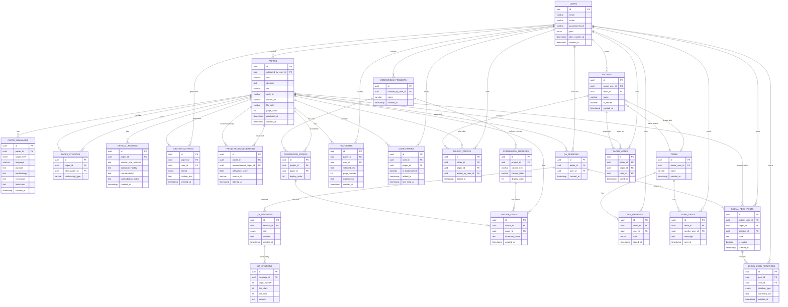

# PaperLens AI — ERD

```mermaid
erDiagram

  %% ─── 사용자 ───
  USERS {
    uuid id PK
    varchar email
    varchar name
    varchar password_hash
    enum plan
    timestamp plan_expires_at
    timestamp created_at
  }

  %% ─── 논문 ───
  PAPERS {
    uuid id PK
    uuid uploaded_by_user_id FK
    varchar title
    text abstract
    varchar doi
    varchar arxiv_id
    varchar source_url
    varchar file_path
    int page_count
    timestamp published_at
    timestamp created_at
  }

  PAPER_SUMMARIES {
    uuid id PK
    uuid paper_id FK
    enum target_level
    varchar language
    text purpose
    text methodology
    text conclusion
    text limitations
    timestamp created_at
  }

  PAPER_CITATIONS {
    uuid id PK
    uuid paper_id FK
    uuid cited_paper_id FK
    varchar relationship_type
  }

  CRITICAL_REVIEWS {
    uuid id PK
    uuid paper_id FK
    text sample_size_analysis
    text statistical_validity
    text reproducibility
    text contradiction_notes
    timestamp created_at
  }

  CITATION_OUTPUTS {
    uuid id PK
    uuid paper_id FK
    uuid user_id FK
    enum format
    text citation_text
    timestamp created_at
  }

  TREND_RECOMMENDATIONS {
    uuid id PK
    uuid paper_id FK
    uuid recommended_paper_id FK
    float relevance_score
    varchar source_db
    timestamp fetched_at
  }

  %% ─── Q&A ───
  QA_SESSIONS {
    uuid id PK
    uuid paper_id FK
    uuid user_id FK
    timestamp created_at
  }

  QA_MESSAGES {
    uuid id PK
    uuid session_id FK
    enum role
    text content
    timestamp created_at
  }

  QA_CITATIONS {
    uuid id PK
    uuid message_id FK
    int page_number
    int line_start
    int line_end
    text excerpt
  }

  HIGHLIGHTS {
    uuid id PK
    uuid paper_id FK
    uuid user_id FK
    text selected_text
    int page_number
    text explanation
    timestamp created_at
  }

  %% ─── 아카이브 ───
  USER_PAPERS {
    uuid id PK
    uuid user_id FK
    uuid paper_id FK
    boolean is_bookmarked
    timestamp added_at
    timestamp last_read_at
  }

  FOLDERS {
    uuid id PK
    uuid owner_user_id FK
    uuid team_id FK
    varchar name
    boolean is_shared
    timestamp created_at
  }

  FOLDER_PAPERS {
    uuid id PK
    uuid folder_id FK
    uuid paper_id FK
    uuid added_by_user_id FK
    timestamp added_at
  }

  %% ─── 비교 분석 ───
  COMPARISON_PROJECTS {
    uuid id PK
    uuid created_by_user_id FK
    varchar name
    timestamp created_at
  }

  COMPARISON_PAPERS {
    uuid id PK
    uuid project_id FK
    uuid paper_id FK
    int display_order
  }

  COMPARISON_MATRICES {
    uuid id PK
    uuid project_id FK
    varchar column_key
    varchar column_label
    int display_order
  }

  MATRIX_CELLS {
    uuid id PK
    uuid matrix_id FK
    uuid paper_id FK
    text extracted_value
    timestamp created_at
  }

  %% ─── 팀 & 협업 ───
  TEAMS {
    uuid id PK
    uuid owner_user_id FK
    varchar name
    timestamp created_at
  }

  TEAM_MEMBERS {
    uuid id PK
    uuid team_id FK
    uuid user_id FK
    enum role
    timestamp joined_at
  }

  TEAM_CHATS {
    uuid id PK
    uuid team_id FK
    uuid sender_user_id FK
    text message
    timestamp sent_at
  }

  PAPER_VOTES {
    uuid id PK
    uuid folder_id FK
    uuid paper_id FK
    uuid user_id FK
    timestamp voted_at
  }

  %% ─── 소셜 피드 ───
  SOCIAL_FEED_POSTS {
    uuid id PK
    uuid author_user_id FK
    uuid paper_id FK
    uuid session_id FK
    text note
    boolean is_public
    timestamp created_at
  }

  SOCIAL_FEED_REACTIONS {
    uuid id PK
    uuid post_id FK
    uuid user_id FK
    enum reaction_type
    text comment_text
    timestamp created_at
  }

  %% ─── USERS 관계 ───
  USERS ||--o{ PAPERS : "uploads"
  USERS ||--o{ USER_PAPERS : "saves"
  USERS ||--o{ FOLDERS : "owns"
  USERS ||--o{ QA_SESSIONS : "conducts"
  USERS ||--o{ HIGHLIGHTS : "creates"
  USERS ||--o{ CITATION_OUTPUTS : "generates"
  USERS ||--o{ TEAM_MEMBERS : "joins"
  USERS ||--o{ TEAM_CHATS : "sends"
  USERS ||--o{ SOCIAL_FEED_POSTS : "posts"
  USERS ||--o{ SOCIAL_FEED_REACTIONS : "reacts"
  USERS ||--o{ COMPARISON_PROJECTS : "creates"
  USERS ||--o{ FOLDER_PAPERS : "adds"
  USERS ||--o{ PAPER_VOTES : "votes"

  %% ─── PAPERS 관계 ───
  PAPERS ||--o{ PAPER_SUMMARIES : "has"
  PAPERS ||--o{ PAPER_CITATIONS : "cites"
  PAPERS ||--o{ PAPER_CITATIONS : "cited by"
  PAPERS ||--o{ CRITICAL_REVIEWS : "has"
  PAPERS ||--o{ CITATION_OUTPUTS : "generates"
  PAPERS ||--o{ TREND_RECOMMENDATIONS : "source of"
  PAPERS ||--o{ TREND_RECOMMENDATIONS : "recommended as"
  PAPERS ||--o{ QA_SESSIONS : "subject of"
  PAPERS ||--o{ HIGHLIGHTS : "has"
  PAPERS ||--o{ USER_PAPERS : "saved in"
  PAPERS ||--o{ FOLDER_PAPERS : "placed in"
  PAPERS ||--o{ COMPARISON_PAPERS : "included in"
  PAPERS ||--o{ MATRIX_CELLS : "fills"
  PAPERS ||--o{ SOCIAL_FEED_POSTS : "referenced in"
  PAPERS ||--o{ PAPER_VOTES : "voted on"

  %% ─── Q&A 관계 ───
  QA_SESSIONS ||--o{ QA_MESSAGES : "contains"
  QA_MESSAGES ||--o{ QA_CITATIONS : "sourced by"
  QA_SESSIONS ||--o{ SOCIAL_FEED_POSTS : "shared in"

  %% ─── 아카이브 관계 ───
  FOLDERS ||--o{ FOLDER_PAPERS : "contains"
  FOLDERS ||--o{ PAPER_VOTES : "scoped to"
  FOLDERS }o--o| TEAMS : "shared with"

  %% ─── 비교 분석 관계 ───
  COMPARISON_PROJECTS ||--o{ COMPARISON_PAPERS : "includes"
  COMPARISON_PROJECTS ||--o{ COMPARISON_MATRICES : "defines columns"
  COMPARISON_MATRICES ||--o{ MATRIX_CELLS : "has values"
  COMPARISON_PAPERS ||--o{ MATRIX_CELLS : "fills rows"

  %% ─── 팀 관계 ───
  TEAMS ||--o{ TEAM_MEMBERS : "has"
  TEAMS ||--o{ TEAM_CHATS : "has"
  TEAMS ||--o{ FOLDERS : "owns shared"

  %% ─── 소셜 관계 ───
  SOCIAL_FEED_POSTS ||--o{ SOCIAL_FEED_REACTIONS : "receives"
```
